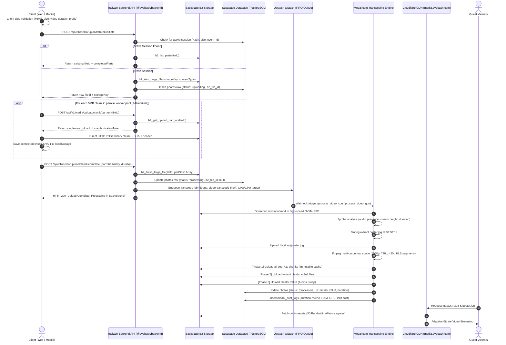

# EveBash Video Upload & Transcoding Pipeline Architecture

This document provides a comprehensive, end-to-end architectural and operational specification of the **Video Upload and Cloud Transcoding Pipeline** in EveBash (`wedding_album`).

It details the lifecycle of video media from user selection in the web/mobile client, through direct-to-storage resumable multipart chunking, asynchronous queue routing, cloud serverless GPU/CPU transcoding, adaptive HLS packaging, atomic playlist distribution, edge CDN delivery, and automated self-healing watchdogs.

---

## 1. System Architecture Overview

EveBash utilizes a **Zero-Server-Bandwidth** and **Cost-Optimized Serverless** architecture designed to handle gigabyte-sized 4K/1080p wedding videos reliably over unpredictable mobile networks without congesting API application servers.

### Core Architectural Pillars
- **Zero-Server-Bandwidth Transfer**: Video binaries stream directly from the client browser or mobile device to **Backblaze B2 Cloud Storage**. The application server only issues single-use presigned authorization tokens and orchestrates metadata.
- **Resumable Multi-Part Chunking**: Videos are split into 5MB chunks. State is tracked dual-layer (client `localStorage` + Backblaze B2 server-side session), permitting instant resumes across network drops, tab reloads, or device switches.
- **Smart Hardware & Cost Routing**: Videos $\le 10$ minutes are processed on serverless **4 vCPU** containers at near-zero compute cost; videos $> 10$ minutes or $> 350\text{ MB}$ route automatically to **NVIDIA L4 GPU** workers for hardware-accelerated NVENC encoding.
- **Atomic HLS Manifest Assembly**: Generates Adaptive Bitrate (ABR) HLS streams (1080p, 720p, 480p) and deploys them to storage via a strict 3-phase atomic upload fleet so viewers never experience 404 segment errors.
- **Zero-Egress Delivery**: Video streaming is fronted by **Cloudflare CDN** under the **Bandwidth Alliance**, resulting in **₹0 ($0) egress fees** between Backblaze B2 and viewers worldwide.
- **Self-Healing Media Watchdog**: Background cron tasks identify stuck processing jobs, automatically re-enqueue transcode tasks up to 3 attempts, and purge abandoned upload sessions older than 24 hours.

---

## 2. End-to-End Pipeline Workflow



---

## 3. Pipeline Stages in Detail

### Stage 1: Client Pre-Flight Validation & Probing
Before opening network connections or requesting upload tokens, the client performs strict local validations in [`src/lib/storage.ts`](file:///Users/sarthak/EveBash/src/lib/storage.ts):

1. **Zero-Byte & Minimum Size Sanity Checks**:
   - File size must not be 0 bytes.
   - File size must be at least 10 KB to prevent corrupt or stubbed file uploads.
2. **MIME Type & Extension Whitelist**:
   - **MIME types**: `video/mp4`, `video/quicktime`, `video/x-msvideo`, `video/x-matroska`, `video/webm`, `video/x-m4v`, `video/3gpp`, `video/x-flv`, `video/x-ms-wmv`, `video/mp2t`, `video/ogg`.
   - **File extensions**: `mp4`, `mov`, `avi`, `mkv`, `webm`, `m4v`, `3gp`, `flv`, `wmv`, `mts`, `m2ts`, `ts`, `ogv`.
3. **In-Browser Metadata Extraction (Duration Probing)**:
   - Creates a headless, ephemeral HTML5 `<video preload="metadata">` DOM node from a local object blob URL (`URL.createObjectURL(file)`).
   - Reads `video.duration` with a strict 2-second timeout.
   - Cleans up memory immediately via `URL.revokeObjectURL(blobUrl)`.
   - This duration estimate is transmitted during upload finalization to allow immediate, accurate workload routing.

---

### Stage 2: Resumable Multipart Chunked Upload Engine
Any file recognized as a video or exceeding 5MB is handled by `uploadLargeFileInChunks()` in [`src/lib/storage.ts`](file:///Users/sarthak/EveBash/src/lib/storage.ts).

#### Chunk Specifications
- **Chunk Size (`CHUNK_SIZE`)**: `5 * 1024 * 1024` bytes (5 MB). This matches Backblaze B2's strict minimum multipart part size requirement.
- **Maximum Parts Supported**: Up to 10,000 parts per file (up to 50 GB per video).

#### Dual-Layer Resumption Protocol
1. **Client Layer (`localStorage`)**:
   - Stores upload state under key `evebash_resume_{fileName}_{fileSize}`.
   - Maintains `fileId`, `storageKey`, `eventId`, `totalChunks`, and a hashmap of `{ [partNumber]: sha1 }`.
2. **Server/Cloud Layer (Backblaze B2 Query)**:
   - When calling `POST /api/v1/media/upload/chunk/initiate`, the Railway backend checks the `photos` table for an existing session where:
     `event_id = eventId AND user_id = userId AND status = 'uploading' AND size = fileSize AND uploaded_at >= now() - 23 hours`
   - If found, it issues `b2_list_parts` directly to Backblaze B2 to inspect what parts are already confirmed in storage.
   - The server responds with `resumed: true` and the list of confirmed part numbers, enabling seamless resume even if the user switches browsers or clears local cookies.

#### Adaptive Concurrency Worker Pool
- **Dynamic Threading**:
  - Desktop browsers: **8 parallel workers**
  - Mobile browsers: **4 parallel workers**
  - Slow / 3G connections (`navigator.connection.effectiveType`): **2 parallel workers**
- **Atomic Shared Queue**: Workers pop pending chunk indices dynamically from an atomic counter.
- **Per-Chunk Single-Use URLs**: Each worker requests a fresh upload URL from `POST /api/v1/media/upload/chunk/part-url` right before uploading. B2 upload URLs are single-use; the backend automatically refreshes expired authentication tokens.
- **Direct-to-B2 Binary Transport**: Chunks are uploaded directly via HTTP POST to the B2 edge endpoint with headers:
  ```http
  Authorization: <b2_part_auth_token>
  Content-Type: application/octet-stream
  X-Bz-Part-Number: <partNumber>
  X-Bz-Content-Sha1: <hex_sha1_digest>
  Content-Length: <chunk_bytes>
  ```
- **Exponential Backoff & Retries**:
  - Each chunk has up to **5 retry attempts**.
  - Wait duration follows $2^n$ exponential backoff ($2\text{s}, 4\text{s}, 8\text{s}, \dots, \max 30\text{s}$) with abort signal listening.
- **Graceful Abort**:
  - If a user cancels the upload, `signal.abort()` fires, triggering `POST /api/v1/media/upload/chunk/abort`.
  - Backend cancels the B2 large file (`b2_cancel_large_file`) and purges the incomplete database record.

---

### Stage 3: Upload Finalization & Database State Machine
Once all chunk uploads complete, the client calls `POST /api/v1/media/upload/chunk/complete` with the array of part SHA-1 digests strictly ordered by `partNumber`.

1. **Backblaze Assembly**:
   - The backend invokes `b2_finish_large_file(fileId, partSha1Array)`.
   - B2 seals the multipart chunks into a single unified object at `storageKey`.
2. **Database Record Transition**:
   - The record in the `photos` table is transitioned:
     - `status`: `"processing"` (crucial: guest-facing queries filter out `status !== 'processed'` for videos so unfinished or unplayable videos never appear in the gallery).
     - `b2_file_id`: set to `null` (large file session complete).
     - `resource_type`: `"video"`.
     - `media_type`: `"video"`.
     - `duration`: pre-extracted duration in seconds.
3. **Owner Push Notification**:
   - Triggers an asynchronous push notification to the event host: `"🎥 New video uploaded"`.

---

### Stage 4: Asynchronous Queue & Smart Hardware Routing
The transcode job is orchestrated via **Upstash QStash** in [`apps/backend/src/qstash.ts`](file:///Users/sarthak/EveBash/apps/backend/src/qstash.ts).

#### Deduplication
- QStash Deduplication ID: `video-transcode-{cleanStorageKey}`.
- Guarantees that duplicate requests within a transcode window will not trigger multiple parallel transcoding runs.

#### Hardware Routing Matrix
To optimize compute spend, videos are categorized by duration and size:

| Video Attribute | Routed Worker | Hardware Allocation | Primary Codec | Economic Impact |
| :--- | :--- | :--- | :--- | :--- |
| **Duration $\le 10$ min** ($600\text{s}$) | `process_video_cpu` | 4 vCPU, 4GB RAM | `libx264` (veryfast) | **Near ₹0** (covered under Modal free tier) |
| **Duration $> 10$ min** or **Size $> 350\text{ MB}$** | `process_video_gpu` | NVIDIA L4 GPU, 4 vCPU, 8GB RAM | `h264_nvenc` (preset p4) | Blazing-fast NVENC encoding for long ceremonies |

*Note: If QStash is not configured in the local development environment, the backend falls back to direct asynchronous webhook invocation.*

---

### Stage 5: Cloud Transcoding Engine (Modal.com)
The transcoding engine runs on **Modal.com** within a custom Docker container ([`modal_engine/main.py`](file:///Users/sarthak/EveBash/modal_engine/main.py)):
- **Base Image**: `jrottenberg/ffmpeg:7.0-nvidia2204` with Python 3.11, `boto3`, `supabase`, and `fastapi`.

#### Transcoding Steps Inside Modal
1. **NVMe Local Cache Download**:
   - Modal container pulls the raw video from Backblaze B2 directly to local NVMe SSD storage (`/tmp/input.mp4`).
2. **Stream Analysis (`ffprobe`)**:
   - Probes audio stream presence (`ffprobe -select_streams a`).
   - Detects source vertical resolution (`ffprobe -select_streams v:0 stream=height`).
   - Obtains precise floating-point video duration (`ffprobe format=duration`).
3. **Poster Extraction**:
   - Captures high-resolution thumbnail at timestamp $t = 00:00:01$:
     ```bash
     ffmpeg -y -i input.mp4 -ss 00:00:01 -vframes 1 -q:v 2 /tmp/poster.jpg
     ```
   - Immediately uploaded to B2 at `hls/{storage_key}/poster.jpg` with `CacheControl: public, max-age=604800`.
4. **Dynamic Multi-Bitrate Ladder (No Upscaling)**:
   - Does not upscale: if the source is 720p, it skips 1080p generation.
   - **1080p (if source $\ge 1080\text{p}$)**: Max bitrate 4000k, maxrate 4500k, bufsize 8000k.
   - **720p (if source $\ge 720\text{p}$)**: Max bitrate 2500k, maxrate 3000k, bufsize 5000k.
   - **480p (baseline - always generated)**: Max bitrate 1000k, maxrate 1200k, bufsize 2000k.
5. **Keyframe Alignment & Audio Normalization**:
   - Segment length: 6 seconds (`-hls_time 6`, `-hls_flags independent_segments`).
   - Strict GOP boundary: `-force_key_frames "expr:gte(t,n_forced*6)"`, `-g 48`, `-keyint_min 48`, `-sc_threshold 0`. This allows instant, seamless switching between bitrates on the client side without audio/video synchronization drift.
   - Audio: Stereo AAC, 128 kbps, 48 kHz.
6. **Automatic GPU $\to$ CPU Failover**:
   - If the `h264_nvenc` GPU pipeline encounters hardware or codec errors, the engine catches the exception and immediately falls back to the CPU software pipeline (`libx264 veryfast`) in the same invocation.

---

### Stage 6: Three-Phase Atomic Upload Fleet
Uploading HLS playlists incorrectly causes race conditions where client video players request playlist manifests before the underlying video chunks exist, leading to playback failures.

To eliminate this, Modal executes a **Three-Phase Atomic Upload Fleet** using a 30-worker `ThreadPoolExecutor`:

1. **Phase 1: Video Segments (`.ts`)**:
   - Uploads all `seg_000.ts` files across all quality directories.
   - HTTP Content-Type: `video/MP2T`
   - Cache-Control: `public, max-age=31536000, immutable` (permanently cacheable at CDN edge).
2. **Phase 2: Variant Playlists (`playlist.m3u8`)**:
   - Uploads resolution-specific playlists (`1080p/playlist.m3u8`, `720p/playlist.m3u8`, `480p/playlist.m3u8`).
   - HTTP Content-Type: `application/x-mpegURL`
3. **Phase 3 (Atomic Swap): Master Manifest (`master.m3u8`)**:
   - Uploads the root `master.m3u8` manifest **last**.
   - Because all referenced variant playlists and transport stream chunks already reside in storage, client players reading the master manifest will never encounter 404 segment errors.

---

### Stage 7: Database Activation & Cost Telemetry Logging
Upon successful upload of all assets:

1. **Supabase Record Activation**:
   ```sql
   UPDATE photos
   SET 
     url = 'https://media.evebash.com/hls/{storage_key}/master.m3u8',
     thumbnail_url = 'https://media.evebash.com/hls/{storage_key}/poster.jpg',
     resource_type = 'video',
     media_type = 'video',
     status = 'processed',
     duration = <probed_seconds>,
     processing_error = NULL
   WHERE id = <photo_id>;
   ```
2. **Compute Cost Telemetry (`modal_cost_logs`)**:
   Every transcoding invocation computes the exact hardware runtime cost and stores it in the database for real-time infrastructure accounting:
   $$\text{Cost (INR)} = \text{duration} \times \left( (\text{vCPU} \times 0.00131) + (\text{RAM\_GB} \times 0.000222) + \text{GPU\_Rate} \right)$$
   Where:
   - GPU Rate = $0.0222$ for NVIDIA L4
   - Logged fields include `photo_id`, `event_id`, `user_id`, `media_size`, `video_duration_seconds`, `execution_time_seconds`, and `estimated_cost_inr`.

---

### Stage 8: Edge CDN Delivery & Playback
- **Media Domain**: `https://media.evebash.com/` routed via Cloudflare.
- **Bandwidth Alliance**: Direct peering between Backblaze B2 and Cloudflare ensures **₹0 egress fees** for all video chunk streaming.
- **Client Playback**:
  - Web: Video player uses `hls.js` or native Safari HLS support.
  - Mobile: React Native `expo-av` / `react-native-video`.
  - The player starts playback on the lowest stream (480p) for instantaneous start time ($< 500\text{ms}$ time-to-first-frame), then automatically shifts up to 720p/1080p based on guest bandwidth.

---

### Stage 9: Self-Healing Media Watchdog
Background watchdog services ([`apps/backend/src/services/watchdog.ts`](file:///Users/sarthak/EveBash/apps/backend/src/services/watchdog.ts)) protect against orphan sessions and stalled tasks:

1. **Stalled Transcode Recovery**:
   - Queries `photos` where `resource_type = 'video' AND status = 'processing'` with `uploaded_at` between 15 minutes and 6 hours ago.
   - If `transcode_attempts < 3`: Increments `transcode_attempts` and re-dispatches the transcode task to QStash.
   - If `transcode_attempts >= 3`: Transitions status to `'failed'` and writes `processing_error = 'Transcoding timed out after 3 automated recovery attempts.'`.
2. **Abandoned Session Cleanup**:
   - Queries `photos` where `status = 'uploading' AND b2_file_id IS NOT NULL` with `uploaded_at < now() - 24 hours`.
   - Calls `cancelLargeFile(b2_file_id)` on Backblaze B2 to release uncommitted multipart storage.
   - Deletes the orphaned row from `photos`, preventing storage cost leaks.

---

## 4. Database Schemas & Status Transitions

### Photo Status Lifecycle
```
[User initiates upload]
           │
           ▼
     'uploading' ───(Timeout > 24h)───► [Watchdog Purge & b2_cancel_large_file]
           │
           │ (All chunks uploaded + b2_finish_large_file)
           ▼
    'processing' ───(Stuck > 15m)─────► [Watchdog re-enqueue (up to 3x)]
           │                                      │
           │ (Transcode & Atomic HLS complete)    │ (Exceeded 3 attempts)
           ▼                                      ▼
      'processed'                             'failed'
```

### Key Columns in `photos`
| Column | Type | Purpose |
| :--- | :--- | :--- |
| `id` | `text` (PK) | Storage key with `/` replaced by `_` |
| `event_id` | `uuid` (FK) | References parent event |
| `storage_key` | `text` | Object path in Backblaze B2 (e.g. `events/{eventId}/{userId}/videos/{uuid}.mp4`) |
| `b2_file_id` | `text` | Active B2 multipart file ID (set during `uploading`, cleared on completion) |
| `url` | `text` | Master playlist HLS URL once processed (`.../master.m3u8`) |
| `thumbnail_url` | `text` | Video poster thumbnail (`.../poster.jpg`) |
| `media_type` | `text` | `"video"` |
| `resource_type` | `text` | `"video"` |
| `status` | `text` | `"uploading"` $\to$ `"processing"` $\to$ `"processed"` / `"failed"` |
| `duration` | `numeric` | Video length in seconds |
| `size` | `bigint` | Original video file size in bytes |
| `transcode_attempts`| `int` | Number of watchdog recovery attempts (max 3) |
| `processing_error` | `text` | Error details if transcoding fails |

---

## 5. API Reference

| Endpoint | Method | Scope / Auth | Description |
| :--- | :--- | :--- | :--- |
| `/api/v1/media/upload/chunk/initiate` | `POST` | Authenticated / Guest | Checks for resumable 23h session or calls `b2_start_large_file` |
| `/api/v1/media/upload/chunk/part-url` | `POST` | Authenticated / Guest | Generates single-use presigned B2 upload URL for a specific part |
| `/api/v1/media/upload/chunk/complete-part`| `POST` | Authenticated / Guest | Telemetry ping logging part completion |
| `/api/v1/media/upload/chunk/complete` | `POST` | Authenticated / Guest | Assembles B2 multipart file, transitions DB to `processing`, and enqueues QStash job |
| `/api/v1/media/upload/chunk/abort` | `POST` | Uploader Only | Cancels B2 multipart session and removes temporary DB record |
| `/api/v1/media/watchdog/run` | `POST` | Internal / Cron | Manually triggers the self-healing media watchdog |

---

## 6. Financial & Infrastructure Unit Economics

Per the approved financial models in [`COST_ANALYSIS.md`](file:///Users/sarthak/EveBash/COST_ANALYSIS.md):

- **Backblaze B2 Storage**: ₹600 per TB/month ($0.006/GB/mo). First 10 GB free.
- **Egress Bandwidth**: **₹0** (100% free via Cloudflare Bandwidth Alliance peering).
- **Modal.com Compute**:
  - $30/month (₹3,000/month) free tier covering $\sim 360,000$ executions.
  - Video compute is heavily amortized by routing $\le 10\text{-minute}$ videos to 4 vCPU software workers.
- **Upstash QStash**: ₹100 per 100,000 messages ($1.00 per 100k), contributing negligible cost ($\approx ₹8/\text{month}$ per active photographer).

---

## 7. Operational Troubleshooting

### Problem: Video is stuck in "processing" state
1. Check the `transcode_attempts` in `photos` table.
2. Check QStash message logs for deduplication key `video-transcode-{key}`.
3. Check Modal dashboard logs under `process_video_cpu` or `process_video_gpu`.
4. Trigger the watchdog endpoint:
   ```bash
   curl -X POST https://api.evebash.com/api/v1/media/watchdog/run \
     -H "Authorization: Bearer <ADMIN_SERVICE_KEY>"
   ```

### Problem: Chunk upload fails with HTTP 410 or "No active upload"
- Occurs if Backblaze B2 multipart session expired or was aborted.
- Client automatically clears `localStorage` and triggers a fresh `initiate` call on the next retry attempt.

### Problem: Video player shows black screen or spinner on initial load
- Check that `photos.status` is `'processed'`. The UI strictly suppresses videos until `status === 'processed'`.
- Verify that `hls/{storage_key}/master.m3u8` is accessible over HTTPS through `media.evebash.com`.
